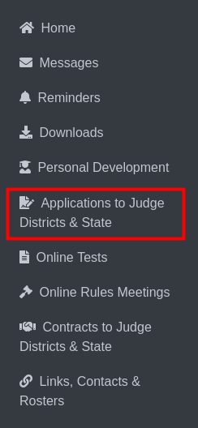

Aplication to Judge Districts & State
======================================

  
By clicking **"Application to Judge Districts & State"** will take you to the Online Rules Meetings page.

.. thumbnail:: ../images/apps_to_judges_pp.png
  :title: Aplication to Judge Districts & State for Play Production.

**(No.1):** The **"Play Production"** tab allows you to view content specific to  Play Production Aplication to Judge Districts & State.

**(No. 2):** The clickable link is provided to Application to Judge Play Production. Clicking this will take you to 
Application to Judge District & State Contests page for play Production.

.. thumbnail:: ../images/apps_to_judges.png
  :title: Aplication to Judge Districts & State for Play Production. 
  
This page allows judges to indicate their availability, preferences, and potential conflicts for judging district and state Play Production contests. 
Users can select available dates, classifications, and note any conflicts with schools for **Play Production**.

Located at the bottom of the form, the **(No.1):**  **Submit** button allows judges to save their application details.

.. thumbnail:: ../images/apps_to_judges_sp.png
  :title: Aplication to Judge Districts & State for Speech.

**(No.1):** The **"Speech"** tab allows you to view content specific to Speech Aplication to Judge Districts & State.

**(No. 2):** The clickable link is provided to Application to Judge Speech. Clicking this will take you to 
Application to Judge District & State Contests page for Speech.

.. thumbnail:: ../images/apps_to_judges_1.png
  :title: Aplication to Judge Districts & State for Speech.

This page allows judges to indicate their availability, preferences, and potential conflicts for judging district and state Speech contests. 
Users can select available dates, classifications, and note any conflicts with schools for **Speech**.

Located at the bottom of the form, the **(No.1):**  **Submit** button allows judges to save their application details.