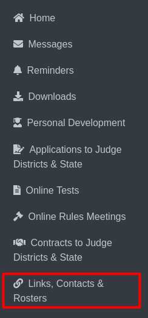

Links, Contacts & Rosters
===========================

**Admin Panel Sidebar:**

  
**Links, Contacts & Rosters**

The labeled item **Links, Contacts & Rosters** Clicking this option redirects the user to the Links, Contacts & Rosters page, where they can view Links, Contacts & Rosters for play production or speech.

.. thumbnail:: ../images/link_roster.png
  :title: Links, Contacts & Rosters
  

**Play Production Tab (No. 1):**
This tab is selected to display Play Production contacts and rosters.
**Speech Tab (No. 2):**
Clicking this tab will switch to displaying contacts and rosters related to Speech.

Below, you'll find details about links, contacts, and rosters for the selected sport (Play Production or Speech).
Selecting a roster will take you to the roster details page.

**Rosters**

.. thumbnail:: ../images/roster.png
  :title: Rosters For Speech

This is roster details for Speech.

**Export Button (No. 1):**
Clicking this button allows users to export the current roster details in XLSX format for further analysis or record-keeping.

**Sorting Arrow (No. 2):**
Each column in the roster (such as Name, Email, etc.) has an arrow icon that allows users to sort the data in either ascending or descending order.

.. thumbnail:: ../images/roster_pp.png
  :title: Rosters For Play Production

This is roster details for Play Production.
