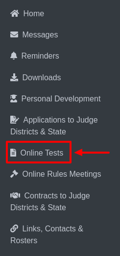

Online Tests
=======================

1. Select the "Online Tests" option from the sidebar.

2. Upon clicking, options for different online tests will be displayed: **Play Production, Technical Theatre,** and **Speech.** 

.. thumbnail:: ../images/online-tests/menu-2.png

3. By default, the online test details for **Play Production** will be shown, including information such as **test due dates, passing scores,** and **the publish date of results.**

.. thumbnail:: ../images/online-tests/play-tests-3.png

4. If you select **Technical Theatre**, the online test details for Technical Theatre will be displayed, following the same format as **Play Production**.

.. thumbnail:: ../images/online-tests/technical-tests-4.png

5. Similarly, selecting **Speech** will show the online test details for Speech, with the same information structure as the other categories.

.. thumbnail:: ../images/online-tests/speech-tests-5.png

* If you have completed any tests, the page will display your test results.

    .. thumbnail:: ../images/online-tests/view-6.png

* To view specific answers, click on View Results to open the Test Results page.

    .. thumbnail:: ../images/online-tests/res-7.png
    
* On the Test Results page, please note: if **two answers are acceptable** for a question, **both answers will be shown as valid**.