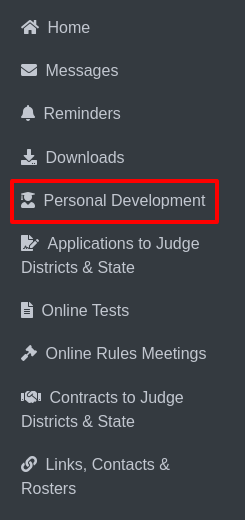

Personal Development
====================================

* Navigate to the **Personal Development** section from the sidebar.

* Upon selection, five distinct categories will be displayed: **I Am Willing, Workshops, Conventions, Continuing Education, and Endorsement**.

**1. I Am Willing:**

    * You can choose to select or deselect options based on your preferences.

    .. thumbnail:: ../images/personal-dev/willing-2.png

    * After making adjustments, click the Save button to apply your changes.

**2. Workshops:**

    * You can select from the list of available workshops or add additional workshops you wish to attend.

    .. thumbnail:: ../images/personal-dev/workshops-3.png

    * Once finalized, click the Save button to record your choices.

**3. Conventions:**

    * Similar to the Workshops section, you may select from the displayed conventions or add other conventions of interest.

    .. thumbnail:: ../images/personal-dev/conventions-4.png

**4. Continuing Education::**

    * Select or deselect the courses you wish to enroll in.
    * For more details about a course, click on the course title to view further information.

    .. thumbnail:: ../images/personal-dev/education-5.png
    
    * Click Save to confirm your selections.

**5. Endorsement:**

    * This section operates in the same manner as Continuing Education, allowing you to choose endorsement and save your selections accordingly.

    .. thumbnail:: ../images/personal-dev/endorsement-6.png