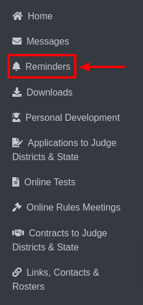

Reminders
=====================

* Select Reminders from the sidebar.

* This will display options such as Application to Judge and Online Tests.

.. thumbnail:: ../images/reminders/menu-2.png

**i. Application to Judge:**

    * This section will display by default.

    .. thumbnail:: ../images/reminders/app-judge-3.png

    * If data is available, it will be shown here; otherwise, the section will remain empty.

**ii. Online Tests:**

    1. When selected, this section will show the types of tests, test due dates, and the final submission dates.

    .. thumbnail:: ../images/reminders/online-tests-4.png

    2. To proceed, click on a specific test, which will open the examination form.

    .. thumbnail:: ../images/reminders/test-5.png
    
    3. Here, you can view the total number of questions, select your preferred answers, and save your responses by clicking the Save button.

    .. thumbnail:: ../images/reminders/examination-6.png

    .. thumbnail:: ../images/reminders/dropdown-7.png
        :width: 200px
    
    4. Once completed, click Finish Submission to preview your answers.

    .. thumbnail:: ../images/reminders/save-8.png

    
    5. For final submission, click Submit Test Answers to complete the process.
    
    .. thumbnail:: ../images/reminders/submit-9.png
    
    
    
    
    

